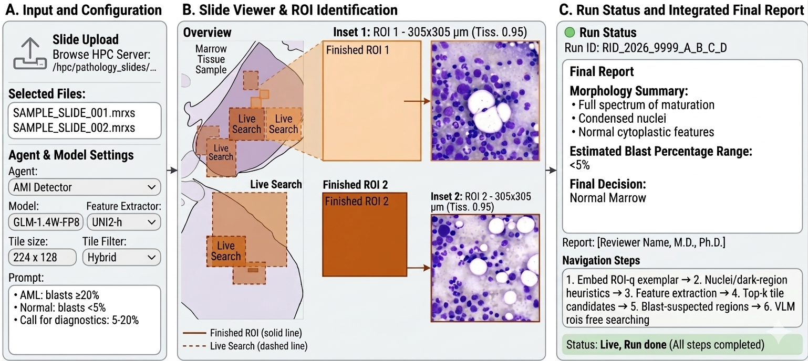

# Slide Agent


## Illustration



An illustration of AML agent

> **Info**
>
> Evaluation on a private dataset (50 AML, 50 normal marrow):  
> ([**Gemma-4-31B-it**](https://huggingface.co/google/gemma-4-31B-it)) achieves the highest decision accuracy.
> ([**UNI-2**](https://github.com/mahmoodlab/UNI)) provides the strongest visual embeddings, outperforming domain-specific blood cell DINO variants.

## Install

### Environment

```bash
uv sync

source .venv/bin/activate
```

### Configure `.env` to your needs

```bash
cp .env.example .env
```

### Configure model name

In `wsi_core.py` and `main.py`, set `MODEL_NAME` and `ALLOWED_MODEL_NAMES` to the models you want exposed in the UI.

### Configure server-side slide roots

The Explorer modal can browse server-local slide roots directly, so large HPC WSIs do not need to be uploaded through the browser.

By default it exposes:

```text
/mnt/copernicus3/PATHOLOGY/others/private/haemadata/ALL_WSIs/
```

To add more roots, set `SERVER_SLIDE_ROOTS` as a colon-separated list before starting the app:

```bash
export SERVER_SLIDE_ROOTS="/mnt/copernicus3/PATHOLOGY/others/private/haemadata/ALL_WSIs/:/some/other/root"
```

The Explorer supports:

- Standard slide files: `.svs`, `.tif`, `.tiff`, `.ndpi`
- MIRAX files: `.mrxs`, `.mrsx`
- MIRAX companion folders: select the folder whose sibling `.mrxs`/`.mrsx` has the same stem

## Run

```bash
python main.py
```

The web app starts on port `3008` by default. If that port is already in use, the server will fall back to the next available port.

## CLI Runs

The repo also includes headless CLI entrypoints for AML runs.

### Single slide

Run one slide without the web UI:

```bash
.venv/bin/python evaluate/run_single_slide.py \
    --slide /path/to/patient.mrxs \
    --output-dir ./batch_outputs \
    --model GPT-OSS-120B \
    --extractor reddino_large \
    --tile-filter hybrid \
    --tile-size-px 224 \
    --batch-size 512 \
    --agent aml
```

Useful flags:

- `--model`: VLM name, for example `GPT-OSS-120B`, `GLM-4.6V-FP8`, `Qwen3.5-397B-A17B-FP8`
- `--extractor`: embedding extractor key such as `uni2`, `reddino`, `reddino_base`, `reddino_large`, `dinobloom`
- `--tile-filter`: one of `hybrid`, `quality`, `coarse`, `none`
- `--experiment-root`: shared cache/output root for repeated runs
- `--use-tile-cache`: reuse persisted tile cache across runs

Outputs are written under `--output-dir/<patient>/` and include:

- `summary.json`
- `final_output.txt`
- `report.json`
- copied ROI/debug images when available

### Batch AML run

Run the AML detector across a CSV of patients or slide stems:

```bash
bash evaluate/run_batch_aml.sh \
    --csv /path/to/patients.csv \
    --slides-root /mnt/copernicus3/PATHOLOGY/others/private/haemadata/ALL_WSIs \
    --output-dir ./batch_result_qwen_reddino_large \
    --experiment-root ./batch_result_qwen_reddino_large \
    --model Qwen3.5-397B-A17B-FP8 \
    --extractor reddino_large \
    --tile-filter hybrid \
    --tile-size-px 224 \
    --batch-size 512 \
    --agent aml \
    --resume \
    --use-tile-cache
```

Notes:

- The CSV is read line-by-line after the header.
- Each row can be either a patient stem or a full `.mrxs` path.
- `--resume` skips patients whose `summary.json` has `status="ok"` and a non-empty `final_decision`.
- If a run fails during the current batch, the script automatically retries that slide once.

### Pre-extract shared cache

If you plan to run a large batch with `--use-tile-cache`, you can prewarm the shared AML tile cache first:

```bash
.venv/bin/python evaluate/preextract_hybrid_cache.py \
    --csv /path/to/patients.csv \
    --slides-root /mnt/copernicus3/PATHOLOGY/others/private/haemadata/ALL_WSIs \
    --experiment-root ./aml_reddino_large_suite \
    --extractor reddino_large \
    --tile-filter hybrid \
    --agent aml \
    --tile-size-px 224 \
    --tile-size-um 256 \
    --batch-size 512 \
    --skip-existing-cache
```

Notes:

- This populates the shared cache under `<experiment-root>/_cache/tile_cache/<extractor>/`.
- It also prepares the AML reference cache under `<experiment-root>/_cache/reference_hnsw/<extractor>/`.
- `--skip-existing-cache` avoids recomputing slides that already have at least one cache zip for that extractor.
- `--limit N` is useful for a quick dry run on a subset of slides.
- This cache layout is the same one reused by `run_batch_aml.sh` and `run_batch_aml_suite.sh` when `--use-tile-cache` is enabled.

### Batch suite

`evaluate/run_batch_aml_suite.sh` is a wrapper for launching multiple model/extractor combinations defined in the `RUNS` array:

```bash
bash evaluate/run_batch_aml_suite.sh \
    --output-parent /mnt/bulk-neptune/nguyenmin/stamp-dev/experiments/Narmin \
    --experiment-name aml_reddino_hybrid_suite \
    --cuda-device 0 \
    --extractors reddino_large \
    --resume \
    --use-tile-cache
```

Notes:

- `--extractors` filters the run specs by extractor key.
- The suite script forwards into `evaluate/run_batch_aml.sh` for each selected run.
- Edit the `RUNS` array in [evaluate/run_batch_aml_suite.sh](/mnt/bulk-neptune/nguyenmin/stamp-dev/Slide-Agent/temp/Pathology_agent/evaluate/run_batch_aml_suite.sh) to choose which model/extractor combinations are launched.
- Each `RUNS` entry has the form `"MODEL|EXTRACTOR|OUTPUT_DIR_NAME"`.
- Example: `"Qwen3.5-397B-A17B-FP8|reddino_large|batch_result_Qwen3.5-397B-A17B-FP8_RedDino-Large_224px"`
- `MODEL` is passed to `--model`, `EXTRACTOR` is passed to `--extractor`, and `OUTPUT_DIR_NAME` becomes the subdirectory created under `--output-parent/--experiment-name` or `--base-output-root`.

## Workbench

The web workbench has three main panels:

- **Input & Run**: select slide source, configure the agent, model, embedding extractor, tile size, batch size, and tile filtering method, then start the run.
- **Slide Viewer**: shows the slide overview plus ROI snapshots collected during navigation.
- **Run Status**: shows live step updates, current model state, errors, and the final report link.

### Slide Sources

You can start a run from:

- uploaded slide files such as `.svs`, `.tif`, `.tiff`, `.ndpi`
- MIRAX folders or zip bundles
- the built-in server Explorer for server-local/HPC slide roots

### Run Controls

- **Agent**: choose between Tile Selector, AML Detector, and General WSI Agent.
- **Model**: choose which VLM is exposed in the workbench.
- **Feature Extractor**: choose the embedding backbone used for ROI candidate preparation.
- **Tile size (px)**: controls the patch size used by the extractor path.
- **Batch size**: controls embedding throughput during tile feature extraction.
- **Tile filter**: controls how candidate tiles are reduced before expensive embedding.

Tile filter options:

- **Quality score**: ranks raw tiles by cheap focus, stain, texture, and artifact heuristics, then keeps the strongest subset plus a small safety reserve.
- **Coarse to fine**: uses a thumbnail-level region prefilter first, then embeds tiles only inside the selected regions.
- **Hybrid**: combines coarse region filtering with the raw-tile quality prefilter.
- **None**: disables the extra tile prefilter stage and keeps the baseline foreground/texture gating only.

### Typical Workbench Flow

1. Choose a slide source or browse the server Explorer.
2. Pick the agent, model, feature extractor, tile size, batch size, and tile filter.
3. Click **Start run**.
4. Follow live status updates in the right panel while reviewing the overview and ROI panes.

## Reference Embeddings (AML Mode)

For AML detection, the agent uses retrieval-based ranking against curated reference tiles. Pre-building embeddings significantly speeds up startup time.

**Quick start:**

```bash
# Pre-build embeddings with reddino (recommended - fast)
python -m wsi_core_pkg.embeddings.prebuild_reference_embeddings \
    --tiles-root ./Selected_Tiles \
    --output-dir ./outputs/cache/reference_hnsw \
    --extractor reddino
```

**Documentation:** See [REFERENCE_EMBEDDINGS.md](REFERENCE_EMBEDDINGS.md) for detailed instructions on:
- Organizing curated tiles
- Extractor options (reddino, dinobloom, uni2)
- Cache management and invalidation
- Environment variable configuration
- Dynamic prototype bank updates
