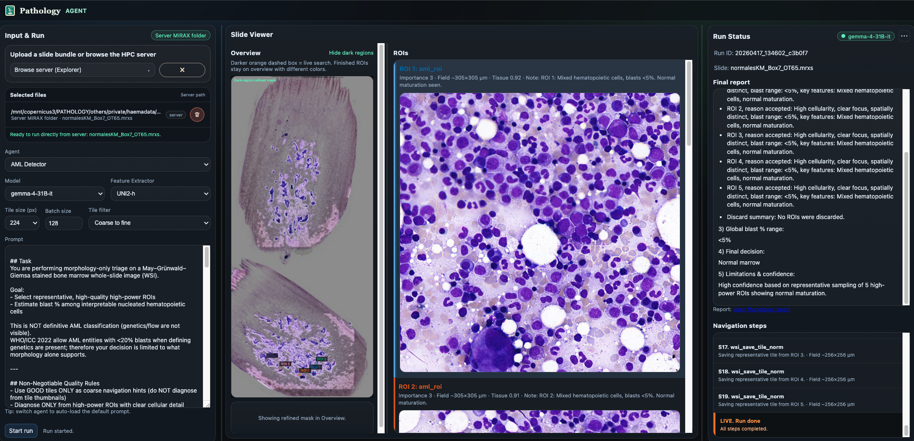

# Slide Morphology Triage Agent

Open-source whole-slide pathology agent for mophology triage ROI collection, morphology-first diagnosis, and interactive WSI exploration. Support general slides and Acute myeloid leukemia (AML) slides

The project combines deterministic slide reduction, embedding-based candidate retrieval, and a vision-language model that navigates high-value regions instead of trying to reason over an entire gigapixel slide at once.

## Highlights

- Interactive FastAPI workbench for browser-based runs and live monitoring.
- Headless evaluation scripts for single-slide, batch, and cache-precomputation workflows.
- Support for standard WSI formats plus MIRAX files and server-local slide browsing.

## Project Visuals


*System overview and WSI workflow.*


*Web workbench run view and result flow.*

## Quick Start

### Install

```bash
uv sync
source .venv/bin/activate
```

### Configure

If your model backend needs API keys or other runtime settings, create a `.env` file with the variables you use locally.

The OpenAI-compatible client settings live in [configs/config.yaml](configs/config.yaml) under the `agent` section:

```yaml
agent:
  OPENAI_API_BASE: "http://pluto/v1"
  OPENAI_API_KEY: "local"
```

Environment variables still override the YAML values, so you can also set them in your shell or `.env`:

```bash
export OPENAI_API_BASE="http://your-server/v1"
export OPENAI_API_KEY="your-key"
```

Update model exposure in [main.py](main.py) and [wsi_core.py](wsi_core.py) by setting `MODEL_NAME` and `ALLOWED_MODEL_NAMES`.

To expose server-local slide roots in the web Explorer, set `SERVER_SLIDE_ROOTS` before starting the app:

```bash
export SERVER_SLIDE_ROOTS="/mnt/copernicus3/PATHOLOGY/others/private/haemadata/ALL_WSIs/:/some/other/root"
```

Supported sources:

- Standard slide files: `.svs`, `.tif`, `.tiff`, `.ndpi`
- MIRAX files: `.mrxs`, `.mrsx`
- MIRAX companion folders: select the folder whose sibling `.mrxs` or `.mrsx` has the same stem

### Run The Workbench

```bash
python main.py
```

The app starts on port `3008` by default and falls forward to the next free port if needed.

## How It Fits Together

```text
WSI
  -> tile extraction and quality filtering
  -> embedding-based candidate ranking
  -> agentic ROI navigation and selection
  -> morphology-only diagnosis from accepted ROIs
```

`aml_auto` is the default production path:

```text
WSI
  -> aml_roi
      -> roi_collection.json + ROI images
  -> aml_diagnosis
      -> final JSON diagnosis + report
```

## Workbench

The web UI is organized around three panels:

- **Input and Run**: slide source, agent, model, extractor, tile size, batch size, and tile filter.
- **Slide Viewer**: slide overview plus ROI snapshots collected during navigation.
- **Run Status**: live steps, current state, errors, and report link.

### Slide Sources

You can start a run from:

- uploaded slide files such as `.svs`, `.tif`, `.tiff`, `.ndpi`
- MIRAX folders or zip bundles
- the built-in server Explorer for server-local or HPC slide roots

### Main Controls

- **Agent**: `aml_auto`, `aml_roi`, `aml_diagnosis`, `aml_detector`, `tile`, or `wsi`
- **Model**: which VLM is exposed in the workbench
- **Feature extractor**: embedding backbone used for ROI candidate preparation
- **Tile size**: patch size for the extractor path
- **Batch size**: embedding throughput during tile feature extraction
- **Tile filter**: candidate prefilter before expensive embedding

Tile filter modes:

- **Quality score**: ranks tiles by focus, stain, texture, and artifact heuristics.
- **Coarse to fine**: thumbnail-level region prefilter before embedding.
- **Hybrid**: combines region screening with raw-tile quality prefiltering.
- **None**: keeps only the baseline foreground and texture gating.

### Typical Flow

1. Choose a slide source or browse the server Explorer.
2. Pick the agent, model, extractor, tile size, batch size, and tile filter.
3. Start the run.
4. Follow the live trace while reviewing the overview and ROI panes.

## Agents

| `agent_type` | Purpose | Slide input | Output |
|---|---|---|---|
| `aml_auto` / `aml` | Full two-stage AML workflow | required | ROI bundle + diagnosis report |
| `aml_roi` | Stage 1 ROI collection only | required | `roi_collection.json` + ROI images |
| `aml_diagnosis` | Stage 2 diagnosis from existing ROIs | not required | strict AML JSON diagnosis |
| `aml_detector` | Legacy single-stage AML agent | required | combined navigation + diagnosis |
| `tile` | Save good and bad tiles for curation or training | required | labeled tiles under `Selected_Tiles` |
| `wsi` | General-purpose pathology exploration agent | required | task-shaped report and saved ROIs |

### AML ROI Collector

`aml_roi` is the evidence-acquisition stage. It navigates the slide, opens ranked candidates, and marks exactly 5 acceptable high-power ROIs for downstream diagnosis.

Outputs include:

- `roi_collection.json`
- `images/roi_N.jpg`
- `images/slide_overview.jpg`
- `images/roi_candidates.jpg`
- navigation summary `report.md`

### AML Diagnosis

`aml_diagnosis` receives ROI images only. It does not navigate the slide and does not see slide-level metadata. The output is a strict JSON object with morphology summary, accepted ROI reasoning, blast range, triage zone, final decision, limitations, confidence, and conditional NPM1 prediction.

### General WSI Agent

`wsi` is the non-AML mode for broader pathology tasks such as tumour description, MSI-oriented inspection, inflammation review, or other prompt-defined workflows.

When prompted for MSI screening, the agent samples at least three distinct tumour regions, marks representative ROIs, and returns a qualitative MSI-H or MSS impression with the caveat that definitive status still requires IHC or molecular testing.

## CLI And Batch Runs

See the dedicated CLI guide: [evaluate/README.md](evaluate/README.md).

Main entrypoints:

- `evaluate/run_single_slide.py`: single-case headless run
- `evaluate/run_batch_aml.sh`: CSV-driven AML batch
- `evaluate/run_batch_aml_suite.sh`: model/extractor suite
- `evaluate/preextract_hybrid_cache.py`: feature-cache prewarm
- `evaluate/preextract_hybrid_cache_suite.sh`: multi-extractor prewarm

## Performance Benchmarks

Evaluated on a private dataset of 372 bone marrow WSIs. VLMs were run in official FP8 quantized variants where available.

### VLM Performance (ROI Collection)

Results are averaged across available feature extractors. `roi5 %` is the percentage of runs where the model successfully reached the 5-ROI target.

| Model | Success % | roi5 % | Avg. tool calls |
|---|---:|---:|---:|
| [gemma-4-31B](https://huggingface.co/google/gemma-4-31B-it) | 100.00 | 71.30 | 21.24 |
| [Qwen3.5-397B](https://huggingface.co/Qwen/Qwen3.5-397B-A17B-FP8) | 99.66 | 99.26 | 25.07 |
| [DeepSeek-V4](https://huggingface.co/models?search=DeepSeek-V4) | 100.00 | 99.73 | 27.10 |
| [GLM-4.6V](https://huggingface.co/zai-org/GLM-4.6V-FP8) | 92.14 | 95.63 | 26.28 |
| [GPT-OSS-120B](https://huggingface.co/models?search=GPT-OSS-120B) | 99.63 | 23.99 | 37.36 |

### AML Detector Results

Gemma-4 and Qwen3.5 were the main diagnosis models explored here: Gemma-4 showed stronger AML-morphology specificity, while Qwen3.5 was more general in blood-cell image understanding.

Prompt wording has some effect, but the results are not dominated by prompt changes alone.

| Model | Ext | Acc % | TP | FN | TN | FP | NPM1 % | HistSim |
|---|---|---:|---:|---:|---:|---:|---:|---:|
| [gemma-4-31B](https://huggingface.co/google/gemma-4-31B-it) | Dino | 70.16 | 234 | 85 | 27 | 26 | 74.43 | 0.889 |
| [gemma-4-31B](https://huggingface.co/google/gemma-4-31B-it) | H-opt | 72.85 | 246 | 73 | 25 | 28 | 71.74 | 0.897 |
| [gemma-4-31B](https://huggingface.co/google/gemma-4-31B-it) | UNI2 | 78.23 | 269 | 50 | 22 | 31 | 73.02 | 0.919 |
| [gemma-4-31B](https://huggingface.co/google/gemma-4-31B-it) | Vir2 | 77.96 | 270 | 49 | 20 | 33 | 72.00 | 0.907 |
| [Qwen3.5-397B](https://huggingface.co/Qwen/Qwen3.5-397B-A17B-FP8) | Dino | 60.48 | 177 | 142 | 48 | 5 | 65.67 | 0.885 |
| [Qwen3.5-397B](https://huggingface.co/Qwen/Qwen3.5-397B-A17B-FP8) | H-opt | 61.02 | 182 | 137 | 45 | 8 | 65.96 | 0.896 |
| [Qwen3.5-397B](https://huggingface.co/Qwen/Qwen3.5-397B-A17B-FP8) | UNI2 | 69.09 | 215 | 104 | 42 | 11 | 64.15 | 0.915 |
| [Qwen3.5-397B](https://huggingface.co/Qwen/Qwen3.5-397B-A17B-FP8) | Vir2 | 66.13 | 207 | 112 | 39 | 14 | 67.88 | 0.906 |

`HistSim` measures histogram similarity between clinician-selected ROIs and agent-selected ROIs.

## Reference Embeddings

AML mode uses retrieval against curated reference tiles to improve ROI ranking. Prebuilding the reference index can reduce startup cost significantly.

Quick start:

```bash
python -m wsi_core_pkg.embeddings.prebuild_reference_embeddings \
    --tiles-root ./Selected_Tiles \
    --output-dir ./outputs/cache/reference_hnsw \
    --extractor reddino
```

Detailed notes live in [evaluate/README.md](evaluate/README.md) under `Reference Embeddings`.

## Documentation Map

- [evaluate/README.md](evaluate/README.md): CLI workflows and reference-embedding setup
- [docs/AML_AGENT_PIPELINE_METHODOLOGY.md](docs/AML_AGENT_PIPELINE_METHODOLOGY.md): methodology and algorithmic description
- [docs/AML_AGENT_PIPELINE_IMPLEMENTATION.md](/mnt/bulk-neptune/nguyenmin/stamp-dev/Slide-Agent/temp/Pathology_agent/docs/AML_AGENT_PIPELINE_IMPLEMENTATION.md): implementation details
- [docs/AML_AGENT_TOOLS_APPENDIX.md](docs/AML_AGENT_TOOLS_APPENDIX.md): tool and navigation appendix
- [docs/AML_PROMPTS_APPENDIX.md](AML_PROMPTS_APPENDIX.md): prompt appendix
- [docs/EVALUATION_METRICS.md](docs/EVALUATION_METRICS.md): metric definitions
