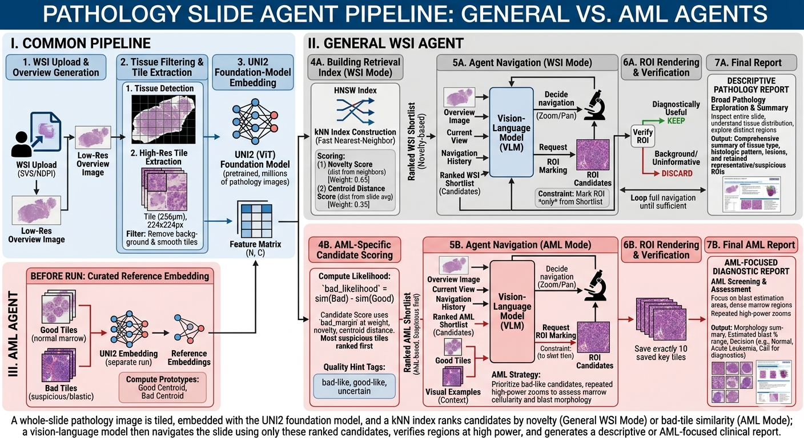

# Slide Agent



## Install

### Environment

```bash
uv sync

source .venv/bin/activate
```

### Configure `.env` to your needs

```bash
cp .env.example .env
```

### Configure model name

In `wsi_core.py` and `main.py`, set `MODEL_NAME` and `ALLOWED_MODEL_NAMES` to the models you want exposed in the UI.

### Configure server-side slide roots

The Explorer modal can browse server-local slide roots directly, so large HPC WSIs do not need to be uploaded through the browser.

By default it exposes:

```text
/mnt/copernicus3/PATHOLOGY/others/private/haemadata/ALL_WSIs/
```

To add more roots, set `SERVER_SLIDE_ROOTS` as a colon-separated list before starting the app:

```bash
export SERVER_SLIDE_ROOTS="/mnt/copernicus3/PATHOLOGY/others/private/haemadata/ALL_WSIs/:/some/other/root"
```

The Explorer supports:

- Standard slide files: `.svs`, `.tif`, `.tiff`, `.ndpi`
- MIRAX files: `.mrxs`, `.mrsx`
- MIRAX companion folders: select the folder whose sibling `.mrxs`/`.mrsx` has the same stem

## Run

```bash
python main.py
```

The web app starts on port `3008` by default. If that port is already in use, the server will fall back to the next available port.

## Workbench

The web workbench has three main panels:

- **Input & Run**: select slide source, configure the agent, model, embedding extractor, tile size, batch size, and tile filtering method, then start the run.
- **Slide Viewer**: shows the slide overview plus ROI snapshots collected during navigation.
- **Run Status**: shows live step updates, current model state, errors, and the final report link.

### Slide Sources

You can start a run from:

- uploaded slide files such as `.svs`, `.tif`, `.tiff`, `.ndpi`
- MIRAX folders or zip bundles
- the built-in server Explorer for server-local/HPC slide roots

### Run Controls

- **Agent**: choose between Tile Selector, AML Detector, and General WSI Agent.
- **Model**: choose which VLM is exposed in the workbench.
- **Feature Extractor**: choose the embedding backbone used for ROI candidate preparation.
- **Tile size (px)**: controls the patch size used by the extractor path.
- **Batch size**: controls embedding throughput during tile feature extraction.
- **Tile filter**: controls how candidate tiles are reduced before expensive embedding.

Tile filter options:

- **Quality score**: ranks raw tiles by cheap focus, stain, texture, and artifact heuristics, then keeps the strongest subset plus a small safety reserve.
- **Coarse to fine**: uses a thumbnail-level region prefilter first, then embeds tiles only inside the selected regions.
- **Hybrid**: combines coarse region filtering with the raw-tile quality prefilter.
- **None**: disables the extra tile prefilter stage and keeps the baseline foreground/texture gating only.

## Illustration

An illustrative ROI image is included as `static/assets/illustration.png`. This image shows a representative high-power marrow field used for demonstration only (not patient data). The field contains numerous large basophilic cells with open chromatin and visible nucleoli; such fields should be treated as morphologically blast-rich and used as a visual example when assessing blast percentage.
### Typical Workbench Flow

1. Choose a slide source or browse the server Explorer.
2. Pick the agent, model, feature extractor, tile size, batch size, and tile filter.
3. Click **Start run**.
4. Follow live status updates in the right panel while reviewing the overview and ROI panes.

## Reference Embeddings (AML Mode)

For AML detection, the agent uses retrieval-based ranking against curated reference tiles. Pre-building embeddings significantly speeds up startup time.

**Quick start:**

```bash
# Pre-build embeddings with reddino (recommended - fast)
python -m wsi_core_pkg.embeddings.prebuild_reference_embeddings \
    --tiles-root ./Selected_Tiles \
    --output-dir ./outputs/cache/reference_hnsw \
    --extractor reddino
```

**Documentation:** See [REFERENCE_EMBEDDINGS.md](REFERENCE_EMBEDDINGS.md) for detailed instructions on:
- Organizing curated tiles
- Extractor options (reddino, dinobloom, uni2)
- Cache management and invalidation
- Environment variable configuration
- Dynamic prototype bank updates
